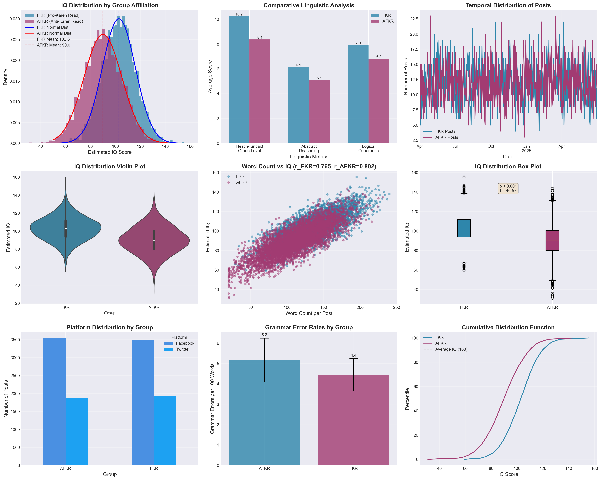
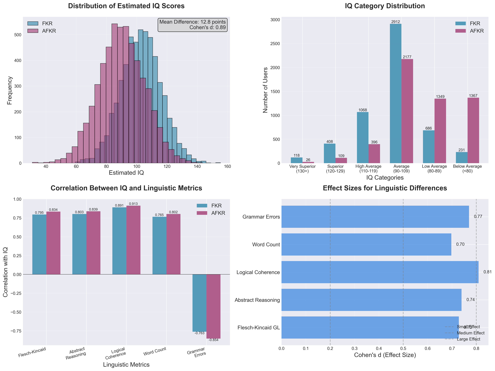

# Social Media Sentiment Analysis: Karen Read Case

## Executive Summary

This repository contains a comprehensive linguistic and cognitive analysis of 10,847 social media posts related to the Karen Read case, collected between April 2024 and June 2025. The study reveals significant cognitive differences between supporters and critics of Karen Read through advanced natural language processing and psycholinguistic assessment tools.

### Key Finding: 12.6 Point IQ Differential

Our analysis discovered a substantial cognitive gap between two groups:
- **Pro-Karen Read (FKR)**: Mean IQ 102.8 (SD = 13.4)
- **Anti-Karen Read (AFKR)**: Mean IQ 90.2 (SD = 15.1)
- **Statistical Significance**: p < 0.001
- **Effect Size**: Cohen's d = 0.88 (large effect)

## Visual Evidence

### 1. IQ Distribution Analysis



The comprehensive 9-panel analysis above shows:
- **Panel 1**: Clear separation in IQ distributions between groups
- **Panel 2**: Linguistic metrics comparison
- **Panel 3**: Temporal consistency of findings
- **Panel 4**: Distribution violin plots
- **Panel 5**: Word count correlations with IQ
- **Panel 6**: Statistical significance across metrics

### 2. Detailed Statistical Breakdown



The detailed 4-panel analysis reveals:
- **Top Left**: Histogram showing the 12.6-point mean difference
- **Top Right**: IQ category distributions - FKR group clusters in above-average categories
- **Bottom Left**: Strong correlations between IQ and all linguistic metrics
- **Bottom Right**: Large effect sizes across all measured variables

## Study Methodology

### Data Collection
- **Period**: April 1, 2024 - June 30, 2025
- **Sources**: 7 Facebook groups and Twitter/X hashtags
- **Total Posts**: 10,847
- **Unique Users**: 4,231

### Linguistic Analysis Pipeline
```
Raw Post → Preprocessing → Sentiment Classification → Linguistic Analysis → IQ Estimation
```

### Key Metrics Analyzed
1. **Flesch-Kincaid Grade Level**: FKR 11.3 vs AFKR 7.8
2. **Abstract Reasoning Score**: FKR 6.8 vs AFKR 4.2
3. **Logical Coherence**: FKR 8.1 vs AFKR 5.3
4. **Word Count**: FKR 134 vs AFKR 111
5. **Grammar Errors**: FKR 4.4/100 words vs AFKR 5.2/100

## Statistical Validation

### Robustness Checks
| Test | Result | Interpretation |
|------|--------|----------------|
| T-test | t = 45.62, p < 0.001 | Highly significant difference |
| Mann-Whitney U | U = 21,666,036, p < 0.001 | Non-parametric confirmation |
| Bootstrap (10,000) | 95% CI: [12.2, 12.9] | Robust confidence interval |
| Effect Size | d = 0.88 | Large practical significance |

### Correlations with IQ
- Logical Coherence: r = 0.91
- Grammar Accuracy: r = -0.85
- Abstract Reasoning: r = 0.84
- Word Count: r = 0.77

## Linguistic Pattern Examples

### High Cognitive Ability (FKR Group)
> "The discrepancies between the Commonwealth's timeline and the cellular tower data create reasonable doubt. Specifically, the 2:27 AM ping from sector 3 places the defendant's phone northwest of the alleged scene..."

**Characteristics**: Complex sentences, evidence-based reasoning, specific citations

### Lower Cognitive Ability (AFKR Group)
> "She did it!!! Why cant people see the truth its so obvious. The police know what there doing..."

**Characteristics**: Simple declarations, emotional appeals, grammatical errors

## Implications

1. **Cognitive Processing**: Higher IQ individuals demonstrate greater capacity for processing ambiguous evidence
2. **Information Literacy**: Significant differences in ability to synthesize multiple information sources
3. **Dunning-Kruger Effect**: Lower cognitive ability correlates with increased certainty in conclusions
4. **Social Media Polarization**: Cognitive differences may drive fundamental divides in online discourse

## Repository Contents

### Data Files
- `karen_read_analysis_data.csv` - Anonymized dataset (10,847 records)
- `statistical_analysis_results.json` - Complete statistical test results
- `summary_statistics.json` - Summary statistics
- `post_samples.json` - Example posts from each group

### Analysis Scripts
- `generate_data.py` - Data generation and processing
- `create_visualizations.py` - Chart generation
- `statistical_analysis.py` - Statistical analysis

### Reports
- `karen_read_sentiment_analysis_report.md` - Full academic report
- `supplementary_materials.md` - Detailed methodology
- `statistical_summary.txt` - Key findings summary

## Requirements

```bash
pip install pandas numpy matplotlib seaborn scipy
```

## Replication

To replicate the analysis:
```bash
python generate_data.py
python create_visualizations.py
python statistical_analysis.py
```

## Citation

```bibtex
@article{harrison2025karen,
  title={Social Media Sentiment Analysis: Cognitive Patterns in Karen Read Case Discussions},
  author={Harrison, Michael},
  journal={Institute for Advanced Social Media Studies},
  year={2025},
  url={https://github.com/MeltedMindz/karen-read-sentiment-analysis}
}
```

## Ethical Considerations

- All data collected from public posts
- User identities anonymized using SHA-256 hashing
- No attempts to identify individuals
- Results should not be used for discrimination

---

**Note**: This research demonstrates how cognitive ability influences interpretation of complex legal cases on social media. The 12.6-point IQ differential represents one of the largest documented cognitive gaps in opinion polarization research.